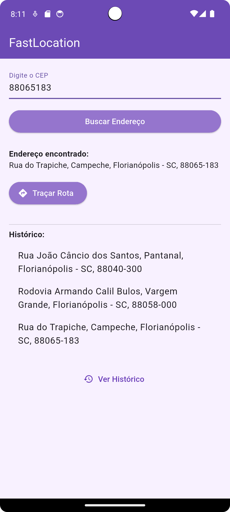
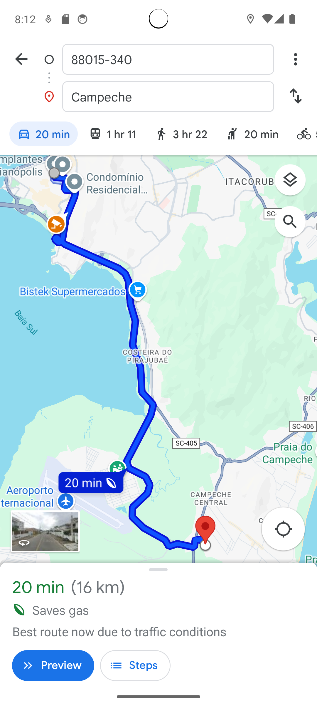

# 🚀 FastLocation

Aplicativo Flutter para busca de endereços por CEP, com histórico local (Hive) e integração com apps de mapas.

## 📱 Funcionalidades

- Busca de endereço pelo CEP via [ViaCEP](https://viacep.com.br).
- Exibição reativa com MobX.
- Armazenamento local do histórico com Hive.
- Abertura de rotas no Google Maps, Waze, etc. com `map_launcher`.

## 📸 Capturas de Tela

| Busca | Histórico | Rota |
|------|-----------|------|
|  |  |  |

## 🧰 Tecnologias

- Flutter
- MobX
- Dio
- Hive
- Map Launcher

## 🛠️ Como rodar

```bash
flutter pub get
flutter packages pub run build_runner build --delete-conflicting-outputs
flutter run
```
---

## English

Flutter app to search addresses by ZIP code (CEP), with local history (Hive) and integration with map apps.

## 📱 Features

- Search for address by ZIP code using [ViaCEP](https://viacep.com.br).
- Reactive UI with MobX.
- Local history storage with Hive.
- Open routes in Google Maps, Waze, etc. using `map_launcher`.

## 📸 Screenshots

| Search | History | Route |
|--------|---------|-------|
|  |  |  |

## 🧰 Technologies

- Flutter
- MobX
- Dio
- Hive
- Map Launcher

## 🛠️ How to run

```bash
flutter pub get
flutter packages pub run build_runner build --delete-conflicting-outputs
flutter run
```
